# Product Requirements Document (PRD) - Azure ML + Fabric Security Enhancement

## 🔒 Virtual Network Isolation and Security Enhancement

> **Project Type:** Infrastructure Security Enhancement
> **Focus Area:** Azure ML + Microsoft Fabric VNet Isolation
> **Technology Stack:** Azure Bicep, Azure Virtual Networks, Private Endpoints, Azure ML, Microsoft Fabric
> **Security Framework:** Azure Well-Architected Framework, Zero-Trust Architecture

---

## 📋 Table of Contents

- [1. Security Overview](#1-security-overview)
- [2. Security Goals](#2-security-goals)
- [3. Virtual Network Architecture Requirements](#3-virtual-network-architecture-requirements)
- [4. Azure ML Security Requirements](#4-azure-ml-security-requirements)
- [5. Storage Security Requirements](#5-storage-security-requirements)
- [6. Network Security Requirements](#6-network-security-requirements)
- [7. Identity and Access Management](#7-identity-and-access-management)
- [8. Monitoring and Compliance](#8-monitoring-and-compliance)
- [9. Technical Implementation Specifications](#9-technical-implementation-specifications)
- [10. Acceptance Criteria](#10-acceptance-criteria)

---

## 1. Security Overview

This security enhancement transforms the existing Azure ML + Fabric solution from public network access to a **zero-trust network architecture** using Azure Virtual Networks with complete isolation of all machine learning resources.

### Current State Analysis
- ✅ **Existing Infrastructure**: Azure ML workspace, storage accounts, Key Vault, Container Registry
- 🔴 **Security Gap**: All services have `publicNetworkAccess: 'Enabled'`
- 🔴 **Network Exposure**: Compute instances have `enableNodePublicIp: true`
- 🔴 **Missing Components**: No VNet, private endpoints, or network security groups

### Target Security Posture
- 🔒 **Zero-Trust Network**: All Azure ML traffic flows through private networks only
- 🛡️ **Private Endpoints**: Storage, Key Vault, and Container Registry accessible only via VNet
- 🔐 **Compute Isolation**: All compute instances and clusters within secure subnets
- 📊 **Secure Monitoring**: Security monitoring and audit logging for all network traffic
- 🌐 **DNS Security**: Private DNS zones for secure endpoint resolution

---

## 2. Security Goals

### Primary Security Objectives
- 🎯 **Eliminate Public Internet Access** to all Azure ML and supporting resources
- 🔒 **Implement Private Network Isolation** using Azure Virtual Networks
- 🛡️ **Secure All Data Paths** between Azure ML workspace and storage accounts
- 🔐 **Enable Secure Remote Access** for development and administration
- 📊 **Implement Comprehensive Security Monitoring** and audit logging
- ⚖️ **Ensure Compliance** with enterprise security standards and zero-trust principles

### Zero-Trust Architecture Principles
- **Never Trust, Always Verify**: All network traffic authenticated and authorized
- **Least Privilege Access**: Minimal access permissions for all identities
- **Assume Breach**: Design for containment and rapid incident response
- **Verify Explicitly**: All access decisions based on multiple signals

---

## 3. Virtual Network Architecture Requirements

| 🏗️ **Component** | 📋 **Specification** | 🎯 **Purpose** | 📝 **Configuration** |
|------------------|---------------------|----------------|---------------------|
| **Hub VNet** | `10.0.0.0/16` | Main network hub | Central connectivity and security |
| **ML Workspace Subnet** | `10.0.1.0/24` | Azure ML workspace | Dedicated subnet for ML services |
| **Compute Subnet** | `10.0.2.0/24` | ML compute resources | Isolated compute instances/clusters |
| **Private Endpoint Subnet** | `10.0.3.0/24` | Private endpoints | Storage, Key Vault, ACR endpoints |
| **Management Subnet** | `10.0.4.0/24` | Bastion and admin | Secure administrative access |

### Subnet Security Requirements
- **Network Security Groups (NSGs)**: Custom rules for each subnet
- **Route Tables**: User-defined routing for traffic control
- **Service Endpoints**: VNet service endpoints for Azure services
- **Subnet Delegation**: Proper delegation for Azure ML compute resources

### Network Connectivity Design

```mermaid
graph TB
    subgraph "Azure Virtual Network (10.0.0.0/16)"
        subgraph "Management Subnet (10.0.4.0/24)"
            BASTION["🛡️ Azure Bastion<br/>Secure RDP/SSH"]
        end

        subgraph "ML Workspace Subnet (10.0.1.0/24)"
            MLWS["🧠 Azure ML Workspace<br/>Private Network Only"]
        end

        subgraph "Compute Subnet (10.0.2.0/24)"
            COMPUTE["💻 Compute Instances<br/>Private IP Only"]
            CLUSTER["🖥️ Compute Clusters<br/>Private IP Only"]
        end

        subgraph "Private Endpoint Subnet (10.0.3.0/24)"
            PE_STORAGE["🗄️ Storage Private Endpoint"]
            PE_KV["🔐 Key Vault Private Endpoint"]
            PE_ACR["📦 ACR Private Endpoint"]
        end
    end

    subgraph "Azure Services"
        STORAGE["💾 Storage Account<br/>Private Access Only"]
        KEYVAULT["🔑 Azure Key Vault<br/>Private Access Only"]
        ACR["📦 Container Registry<br/>Private Access Only"]
    end

    PE_STORAGE -.->|Private Link| STORAGE
    PE_KV -.->|Private Link| KEYVAULT
    PE_ACR -.->|Private Link| ACR

    MLWS --> PE_STORAGE
    MLWS --> PE_KV
    MLWS --> PE_ACR
    COMPUTE --> PE_STORAGE
    CLUSTER --> PE_STORAGE
```


---

## 4. Azure ML Security Requirements

### Azure ML Workspace Security Configuration

| 🔧 **Security Setting** | ⚙️ **Required Value** | 📋 **Purpose** |
|-------------------------|----------------------|----------------|
| **Public Network Access** | `Disabled` | Eliminate internet access |
| **Private Link Endpoint** | `Required` | Enable VNet connectivity |
| **Managed VNet** | `Enabled` | Automatic network isolation |
| **Managed Identity** | `SystemAssigned` | Secure service authentication |

### Compute Security Requirements

| 💻 **Compute Type** | 🔒 **Security Configuration** | 📋 **Network Settings** |
|--------------------|------------------------------|------------------------|
| **Compute Instances** | Private IP only, no public IP | VNet subnet integration |
| **Compute Clusters** | Private IP only, scale to zero | Auto-scaling with security |
| **Inference Clusters** | Private endpoints for APIs | Managed endpoint security |

### Required Bicep Template Updates

```bicep
// Azure ML Workspace - Private Network Configuration
resource mlWorkspace 'Microsoft.MachineLearningServices/workspaces@2023-04-01' = {
  name: workspaceName
  location: location
  properties: {
    // SECURITY UPDATE: Disable public network access
    publicNetworkAccess: 'Disabled'

    // SECURITY UPDATE: Enable managed virtual network
    managedNetwork: {
      isolationMode: 'AllowInternetOutbound'
      outboundRules: {
        // Only allow essential Azure services
        AzureResourceManager: {
          type: 'ServiceTag'
          destination: 'AzureResourceManager'
        }
        AzureStorage: {
          type: 'ServiceTag'
          destination: 'Storage'
        }
      }
    }

    // SECURITY UPDATE: Private Link configuration
    privateEndpointConnections: []

    // Existing properties...
    keyVault: resourceId('Microsoft.KeyVault/vaults', keyVaultName)
    applicationInsights: resourceId('Microsoft.Insights/components', applicationInsightsName)
    containerRegistry: resourceId('Microsoft.ContainerRegistry/registries', containerRegistryName)
    storageAccount: resourceId('Microsoft.Storage/storageAccounts', storageAccountName)
  }
}

// Compute Cluster - Private Network Configuration
resource computeCluster 'Microsoft.MachineLearningServices/workspaces/computes@2023-04-01' = {
  parent: mlWorkspace
  name: 'secure-training-cluster'
  properties: {
    computeType: 'AmlCompute'
    properties: {
      vmSize: 'Standard_DS3_v2'

      // SECURITY UPDATE: Disable public IP
      enableNodePublicIp: false

      // SECURITY UPDATE: Enable VNet integration
      subnet: {
        id: resourceId('Microsoft.Network/virtualNetworks/subnets', vnetName, computeSubnetName)
      }

      // SECURITY UPDATE: Network isolation
      isolatedNetwork: true

      scaleSettings: {
        minNodeCount: 0
        maxNodeCount: 4
        nodeIdleTimeBeforeScaleDown: 'PT5M'
      }
    }
  }
}
```

---

## 5. Storage Security Requirements

### Storage Account Security Configuration

| 🔒 **Security Feature** | ⚙️ **Configuration** | 📋 **Purpose** |
|------------------------|---------------------|----------------|
| **Public Network Access** | `Disabled` | Block internet access |
| **Private Endpoints** | `Required` | VNet-only connectivity |
| **Network ACLs** | `Deny by default` | Whitelist-based access |
| **Secure Transfer** | `Required` | HTTPS/TLS enforcement |
| **Minimum TLS Version** | `TLS1_2` | Modern encryption |

### Private Endpoint Requirements

| 🔗 **Endpoint Type** | 🎯 **Target Resource** | 📋 **DNS Configuration** |
|--------------------|----------------------|--------------------------|
| **Blob Private Endpoint** | Storage Account Blob service | `privatelink.blob.core.windows.net` |
| **File Private Endpoint** | Storage Account File service | `privatelink.file.core.windows.net` |
| **Queue Private Endpoint** | Storage Account Queue service | `privatelink.queue.core.windows.net` |
| **Table Private Endpoint** | Storage Account Table service | `privatelink.table.core.windows.net` |

### Required Bicep Template Updates

```bicep
// Storage Account - Private Network Configuration
resource storageAccount 'Microsoft.Storage/storageAccounts@2022-09-01' = {
  name: storageAccountName
  location: location
  properties: {
    // SECURITY UPDATE: Disable public network access
    publicNetworkAccess: 'Disabled'

    // SECURITY UPDATE: Network ACLs for VNet only
    networkAcls: {
      bypass: 'AzureServices'
      defaultAction: 'Deny'
      virtualNetworkRules: [
        {
          id: resourceId('Microsoft.Network/virtualNetworks/subnets', vnetName, mlSubnetName)
          action: 'Allow'
        }
        {
          id: resourceId('Microsoft.Network/virtualNetworks/subnets', vnetName, computeSubnetName)
          action: 'Allow'
        }
      ]
      ipRules: []
    }

    // Enhanced security settings
    minimumTlsVersion: 'TLS1_2'
    supportsHttpsTrafficOnly: true
    allowBlobPublicAccess: false
    allowSharedKeyAccess: false  // Prefer managed identity
  }
}

// Private Endpoint for Storage Account
resource storagePrivateEndpoint 'Microsoft.Network/privateEndpoints@2023-04-01' = {
  name: '${storageAccountName}-pe'
  location: location
  properties: {
    subnet: {
      id: resourceId('Microsoft.Network/virtualNetworks/subnets', vnetName, privateEndpointSubnetName)
    }
    privateLinkServiceConnections: [
      {
        name: '${storageAccountName}-connection'
        properties: {
          privateLinkServiceId: storageAccount.id
          groupIds: ['blob']
        }
      }
    ]
  }
}
```

---

## 6. Network Security Requirements

### Network Security Groups (NSG) Rules

#### ML Workspace Subnet NSG
| 🔄 **Direction** | 🚦 **Action** | 📋 **Source** | 🎯 **Destination** | 🔌 **Port** | 📝 **Purpose** |
|-----------------|---------------|---------------|-------------------|-------------|---------------|
| Inbound | Allow | VirtualNetwork | VirtualNetwork | 443 | Azure ML services |
| Inbound | Allow | AzureLoadBalancer | * | * | Health probes |
| Inbound | Deny | Internet | * | * | Block internet |
| Outbound | Allow | VirtualNetwork | AzureCloud | 443 | Azure services |
| Outbound | Allow | VirtualNetwork | Storage | 443 | Storage access |
| Outbound | Deny | * | Internet | * | Block internet |

#### Compute Subnet NSG
| 🔄 **Direction** | 🚦 **Action** | 📋 **Source** | 🎯 **Destination** | 🔌 **Port** | 📝 **Purpose** |
|-----------------|---------------|---------------|-------------------|-------------|---------------|
| Inbound | Allow | VirtualNetwork | VirtualNetwork | 22,3389 | Management access |
| Inbound | Allow | AzureLoadBalancer | * | * | Health probes |
| Inbound | Deny | Internet | * | * | Block internet |
| Outbound | Allow | VirtualNetwork | Storage | 443 | Data access |
| Outbound | Allow | VirtualNetwork | AzureCloud | 443 | Azure services |
| Outbound | Deny | * | Internet | * | Block internet |

### Route Table Configuration

| 🗺️ **Route Name** | 🎯 **Destination** | ⭐ **Next Hop Type** | 📝 **Purpose** |
|-------------------|-------------------|---------------------|---------------|
| **ToAzureServices** | `AzureCloud` | `Internet` | Azure service connectivity |
| **ToStorage** | `Storage` | `VnetLocal` | Local storage access |
| **BlockInternet** | `0.0.0.0/0` | `None` | Block internet access |

---

## 7. Identity and Access Management

### Managed Identity Configuration

| 🔐 **Service** | 🆔 **Identity Type** | 🎯 **Required Roles** | 📋 **Purpose** |
|---------------|---------------------|---------------------|---------------|
| **Azure ML Workspace** | System Assigned | Storage Blob Data Contributor | Data access |
| **Azure ML Workspace** | System Assigned | Key Vault Secrets User | Secret access |
| **Azure ML Workspace** | System Assigned | AcrPull | Container image access |
| **Compute Clusters** | System Assigned | Storage Blob Data Reader | Training data access |

### RBAC Requirements

| 👤 **Principal** | 🎯 **Resource** | 🔐 **Role** | 📋 **Justification** |
|-----------------|---------------|-------------|---------------------|
| ML Engineers | Azure ML Workspace | Azure ML Data Scientist | Model development |
| DevOps Team | Resource Group | Contributor | Infrastructure management |
| Security Team | All Resources | Security Reader | Security monitoring |
| Developers | Storage Account | Storage Blob Data Reader | Data access only |

### Required Bicep Template Updates

```bicep
// Managed Identity Role Assignments
resource mlWorkspaceStorageRole 'Microsoft.Authorization/roleAssignments@2022-04-01' = {
  scope: storageAccount
  name: guid(mlWorkspace.id, storageAccount.id, 'ba92f5b4-2d11-453d-a403-e96b0029c9fe')
  properties: {
    roleDefinitionId: subscriptionResourceId('Microsoft.Authorization/roleDefinitions', 'ba92f5b4-2d11-453d-a403-e96b0029c9fe')
    principalType: 'ServicePrincipal'
    principalId: mlWorkspace.identity.principalId
  }
}

resource mlWorkspaceKeyVaultRole 'Microsoft.Authorization/roleAssignments@2022-04-01' = {
  scope: keyVault
  name: guid(mlWorkspace.id, keyVault.id, 'b86a8fe4-44ce-4948-aee5-eccb2c155cd7')
  properties: {
    roleDefinitionId: subscriptionResourceId('Microsoft.Authorization/roleDefinitions', 'b86a8fe4-44ce-4948-aee5-eccb2c155cd7')
    principalType: 'ServicePrincipal'
    principalId: mlWorkspace.identity.principalId
  }
}
```

---

## 8. Monitoring and Compliance

### Security Monitoring Requirements

| 📊 **Monitoring Area** | 🔍 **Metrics/Logs** | 🚨 **Alerts** | 📋 **Purpose** |
|-----------------------|---------------------|---------------|---------------|
| **Network Traffic** | NSG Flow Logs | Unusual traffic patterns | Threat detection |
| **Private Endpoints** | Connection status | Endpoint failures | Connectivity monitoring |
| **Authentication** | Azure AD sign-ins | Failed authentications | Security incidents |
| **Resource Access** | Activity logs | Unauthorized access | Compliance auditing |

### Required Diagnostic Settings

| 🎯 **Resource** | 📋 **Log Categories** | 🏪 **Destination** | ⏰ **Retention** |
|---------------|---------------------|-------------------|-----------------|
| **Azure ML Workspace** | AmlComputeClusterEvent, AmlComputeClusterNodeEvent | Log Analytics | 90 days |
| **Storage Account** | StorageRead, StorageWrite, StorageDelete | Log Analytics | 90 days |
| **Key Vault** | AuditEvent | Log Analytics | 365 days |
| **Virtual Network** | NetworkSecurityGroupEvent | Log Analytics | 30 days |

### Security Alerting Rules

```bicep
// Security Alert Rules
resource unusualNetworkTrafficAlert 'Microsoft.Insights/scheduledQueryRules@2023-03-15-preview' = {
  name: 'unusual-network-traffic'
  location: location
  properties: {
    displayName: 'Unusual Network Traffic Pattern'
    description: 'Detects unusual network traffic patterns in ML subnets'
    severity: 2
    enabled: true
    evaluationFrequency: 'PT5M'
    windowSize: 'PT15M'
    criteria: {
      allOf: [
        {
          query: '''
            AzureNetworkAnalytics_CL
            | where SubType_s == "FlowLog"
            | where Subnet_s in ("ml-subnet", "compute-subnet")
            | where FlowType_s == "ExternalPublic"
            | summarize count() by bin(TimeGenerated, 5m)
            | where count_ > 10
          '''
          timeAggregation: 'Count'
          operator: 'GreaterThan'
          threshold: 0
        }
      ]
    }
    actions: {
      actionGroups: [logAnalyticsWorkspace.id]
    }
  }
}
```

---

## 9. Technical Implementation Specifications

### Bicep Module Structure

```
infra/
├── main.bicep                          # Updated main template
├── modules/
│   ├── networking.bicep               # NEW: VNet and NSG configuration
│   ├── private-endpoints.bicep        # NEW: Private endpoint deployments
│   ├── azureml-secure.bicep          # UPDATED: Secure ML workspace
│   ├── security-enhanced.bicep        # UPDATED: Enhanced security config
│   └── monitoring-security.bicep      # UPDATED: Security monitoring
└── parameters/
    ├── main.parameters.json           # UPDATED: Security parameters
    └── networking.parameters.json     # NEW: Network configuration
```

### Network Module Requirements

```bicep
// Required parameters for networking module
param vnetAddressPrefix string = '10.0.0.0/16'
param mlSubnetAddressPrefix string = '10.0.1.0/24'
param computeSubnetAddressPrefix string = '10.0.2.0/24'
param privateEndpointSubnetAddressPrefix string = '10.0.3.0/24'
param managementSubnetAddressPrefix string = '10.0.4.0/24'

// Required outputs for integration
output vnetId string = vnet.id
output mlSubnetId string = mlSubnet.id
output computeSubnetId string = computeSubnet.id
output privateEndpointSubnetId string = privateEndpointSubnet.id
output managementSubnetId string = managementSubnet.id
```

### Private DNS Configuration

| 🌐 **DNS Zone** | 🎯 **Service** | 📋 **Purpose** |
|---------------|---------------|---------------|
| `privatelink.blob.core.windows.net` | Storage Account | Blob endpoint resolution |
| `privatelink.vaultcore.azure.net` | Key Vault | Key Vault endpoint resolution |
| `privatelink.azurecr.io` | Container Registry | ACR endpoint resolution |
| `privatelink.api.azureml.ms` | Azure ML | ML workspace endpoint resolution |

---

## 10. Acceptance Criteria

### Security Validation Checklist

#### Network Isolation Verification
- [ ] ✅ **Zero Public IP Access**: No Azure ML compute resources have public IP addresses
- [ ] ✅ **Private Network Only**: All Azure ML workspace traffic flows through VNet
- [ ] ✅ **Storage Isolation**: Storage accounts accessible only via private endpoints
- [ ] ✅ **Internet Blocking**: No direct internet access from ML compute resources

#### Connectivity Testing
- [ ] ✅ **Private Endpoint Resolution**: All private endpoints resolve correctly via private DNS
- [ ] ✅ **Service Connectivity**: Azure ML workspace can access storage, Key Vault, and ACR
- [ ] ✅ **Compute Connectivity**: Compute instances can access required Azure services
- [ ] ✅ **Bastion Access**: Secure administrative access via Azure Bastion

#### Security Monitoring Validation
- [ ] ✅ **Network Flow Logs**: NSG flow logs capturing all network traffic
- [ ] ✅ **Security Alerts**: Automated alerts for security incidents
- [ ] ✅ **Audit Logging**: Comprehensive audit trails for all resource access
- [ ] ✅ **Compliance Reporting**: Security compliance dashboard operational

### Performance Validation
- [ ] ✅ **Training Performance**: ML training jobs complete within expected timeframes
- [ ] ✅ **Inference Latency**: Real-time inference maintains < 1 second response time
- [ ] ✅ **Storage Performance**: No degradation in storage access speeds
- [ ] ✅ **Network Throughput**: Network performance meets ML workload requirements

### Deployment Validation
- [ ] ✅ **Bicep Template Deployment**: All templates deploy without errors
- [ ] ✅ **Parameter Validation**: Environment-specific parameters work correctly
- [ ] ✅ **Dependency Management**: Proper resource deployment ordering
- [ ] ✅ **Rollback Capability**: Ability to rollback to previous configuration

---

## 🎯 Implementation Phases

### Phase 1: Network Foundation (Priority: High)
1. **Create Virtual Network Infrastructure**
   - Deploy VNet with security-hardened subnets
   - Configure Network Security Groups with restrictive rules
   - Set up route tables for controlled traffic flow

2. **Implement Private DNS**
   - Create private DNS zones for all Azure services
   - Configure DNS resolution for private endpoints
   - Test DNS resolution from all subnets

### Phase 2: Storage Security (Priority: High)
1. **Secure Storage Accounts**
   - Disable public network access on existing storage
   - Deploy private endpoints for blob, file, queue, and table services
   - Update network ACLs to VNet-only access

2. **Configure Key Vault Security**
   - Deploy Key Vault private endpoint
   - Update access policies for VNet-only access
   - Test managed identity authentication

### Phase 3: Azure ML Security (Priority: Critical)
1. **Secure Azure ML Workspace**
   - Enable managed virtual network on ML workspace
   - Disable public network access
   - Configure private endpoint connections

2. **Secure Compute Resources**
   - Update compute clusters to use private IPs only
   - Configure subnet delegation for ML compute
   - Test compute connectivity and performance

### Phase 4: Monitoring & Compliance (Priority: Medium)
1. **Deploy Security Monitoring**
   - Configure diagnostic settings for all resources
   - Set up security alert rules
   - Create compliance dashboards

2. **Implement Network Monitoring**
   - Enable NSG flow logs
   - Configure network traffic analytics
   - Set up unusual activity alerts

### Success Criteria Summary

✅ **Zero-Trust Architecture**: Complete elimination of public internet access
✅ **Private Network Isolation**: All ML resources communicate via private networks only
✅ **Secure Remote Access**: Administrative access via Azure Bastion
✅ **Compliance Monitoring**: Comprehensive security monitoring and audit logging
✅ **Performance Maintenance**: No degradation in ML workload performance
✅ **Deployment Automation**: One-command deployment via `azd up`

---

*Document Version: 1.0 | Security Enhancement PRD | Target Completion: Q1 2025*