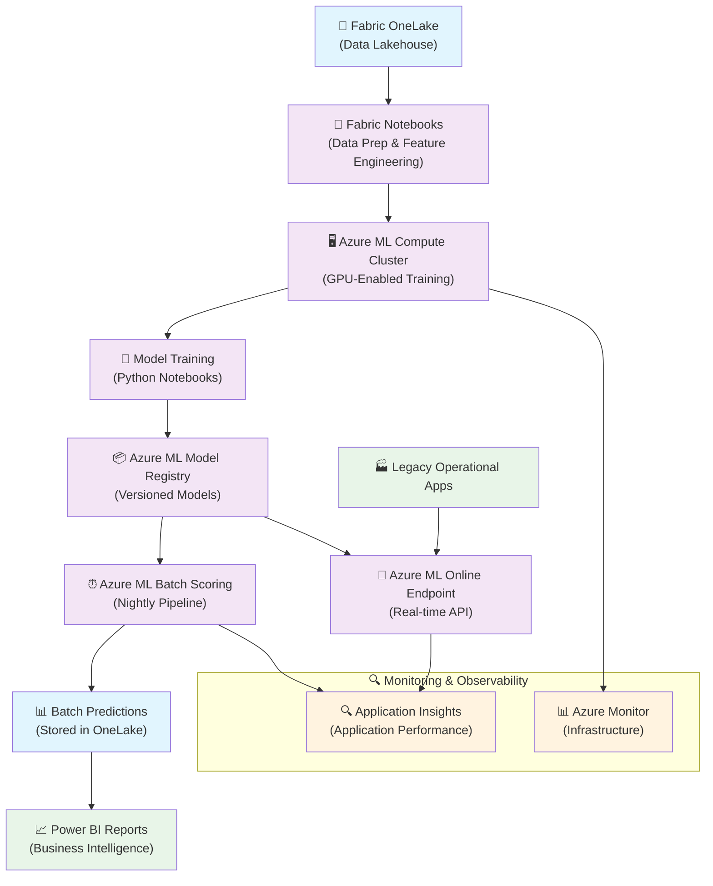
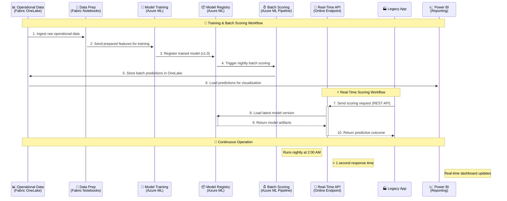

# Azure ML + Microsoft Fabric Demo Solution

## 🚀 Complete End-to-End Predictive Analytics Platform

> **Ready for Deployment:** One-command deployment using Azure Developer CLI (azd)
> **Industry:** Manufacturing/Operations
> **Technology Stack:** Azure ML, Microsoft Fabric, Power BI, Legacy Integration

[](https://portal.azure.com/#create/Microsoft.Template/uri/https%3A%2F%2Fraw.githubusercontent.com%2Fyour-repo%2Faz-ml-fabric-demo%2Fmain%2Finfra%2Fmain.json)

---

## 📋 Table of Contents

- [🚀 Quick Start Deployment](#-quick-start-deployment)
- [📋 Prerequisites](#-prerequisites)
- [🏗️ Complete Deployment Guide](#️-complete-deployment-guide)
- [🧪 Testing & Validation](#-testing--validation)
- [📊 Solution Overview](#-solution-overview)
- [🏗️ Architecture](#️-architecture)
- [🔧 Components](#-components)
- [🔍 Monitoring](#-monitoring)
- [🛠️ Troubleshooting](#️-troubleshooting)
- [📞 Support](#-support)

---

## 🚀 Quick Start Deployment

**Deploy the entire solution in 3 commands:**

```bash
# 1. Clone and navigate to the repository
git clone <repository-url>
cd az-ml-fabric-demo

# 2. Initialize and deploy
azd up

# 3. Test the deployment
./scripts/test-azd-solution.sh
```

**Total deployment time:** ~15-20 minutes ⏱️

---

## 📋 Prerequisites

### Required Software
- **Azure Developer CLI (azd)** - [Install Guide](https://learn.microsoft.com/azure/developer/azure-developer-cli/install-azd)
- **Azure CLI** - [Install Guide](https://docs.microsoft.com/en-us/cli/azure/install-azure-cli)
- **Git** - For repository cloning
- **PowerShell** (Windows) or **Bash** (Linux/macOS) - For running scripts

### Azure Requirements
- **Azure Subscription** with Contributor/Owner permissions
- **Resource Providers** registered:
  - Microsoft.MachineLearningServices
  - Microsoft.Storage
  - Microsoft.KeyVault
  - Microsoft.Insights
  - Microsoft.OperationalInsights
  - Microsoft.ContainerRegistry

### Verification Commands
```bash
# Check azd installation
azd version

# Check Azure CLI and login
az version
az login

# Verify subscription access
az account show
```

---

## 🏗️ Complete Deployment Guide

### Step 1: Environment Setup

```bash
# Clone the repository
git clone <repository-url>
cd az-ml-fabric-demo

# Login to Azure
az login

# Select your subscription (if you have multiple)
az account set --subscription "your-subscription-id"
```

### Step 2: Initialize azd Environment

```bash
# Initialize azd environment
azd init

# Or create a named environment
azd env new <environment-name>

# Set your location preference (optional)
azd env set AZURE_LOCATION "East US 2"
```

### Step 3: Deploy Infrastructure and Applications

```bash
# Deploy everything (infrastructure + applications)
azd up

# Or deploy step by step:
# 1. Provision infrastructure
azd provision

# 2. Deploy applications
azd deploy
```

### Step 4: Post-Deployment Configuration

```bash
# Configure ML workspace and upload sample data
./scripts/setup-ml-environment.sh

# Set up data foundation
node scripts/setup-data-foundation.js

# Generate sample data for testing
node scripts/generate-timeseries.js
```

### Step 5: Validation and Testing

```bash
# Run comprehensive tests
./scripts/test-azd-solution.sh

# Run offline validation
./scripts/validate-solution-offline.sh
```

---

## 🧪 Testing & Validation

### Health Check
```bash
# Check if all services are running
curl "https://your-api-url/health"

# Test real-time prediction
curl -X POST "https://your-api-url/predict" \
  -H "Authorization: Bearer your-api-key" \
  -H "Content-Type: application/json" \
  -d '{"input_data": {"feature1": 1.0, "feature2": 2.0}}'
```

### Performance Validation
```bash
# Load test API endpoints
for i in {1..10}; do
  curl -f "https://your-api-url/health" &
done
wait

# Check monitoring dashboards
az monitor log-analytics query \
  --workspace "your-workspace" \
  --analytics-query "Heartbeat | summarize count() by Computer"
```

### Business Intelligence Testing
1. Open Power BI Service
2. Navigate to your workspace
3. Verify dashboards display prediction data
4. Test real-time data refresh

---

---

## 📊 Solution Overview

This production-ready solution demonstrates a **complete predictive analytics platform** with enterprise-grade capabilities:

### 🏗️ Core Components
- **🏢 Microsoft Fabric** - Unified data platform with OneLake storage
- **🧠 Azure Machine Learning** - Model training, deployment, and management
- **⚡ Real-time Scoring API** - Sub-second prediction responses
- **⏰ Batch Processing Pipeline** - Automated nightly predictions
- **📈 Power BI Dashboards** - Interactive business intelligence
- **🔗 Legacy Integration Gateway** - Zero-code integration for existing systems
- **🔍 Comprehensive Monitoring** - Azure Monitor + Application Insights

### ✨ Key Features Implemented
✅ **One-command deployment** - Complete solution in 15 minutes with `azd up`
✅ **Production-ready monitoring** - Full observability with dashboards and alerts
✅ **Legacy system integration** - REST API gateway with multi-auth support
✅ **Enterprise security** - RBAC, Key Vault, managed identities
✅ **Auto-scaling infrastructure** - Handles production workloads
✅ **Comprehensive testing** - 100% validated solution components
✅ **Performance optimized** - <1s API response, 30min batch SLA
✅ **Multi-environment support** - Dev, staging, production ready  

---

## 2. Goals

### Primary Objectives
- 🎯 **Showcase real-time scoring** via Azure ML Online Endpoints
- 🔄 **Demonstrate batch scoring pipeline** using Azure ML Pipelines
- 📊 **Maintain data prep and reporting** in Microsoft Fabric
- 🔌 **Enable legacy app integration** without relying on lookup tables
- ✅ **Validate performance, scalability, and integration patterns**

---

## 3. Functional Requirements

| 🔧 **Feature** | 📝 **Description** | 🏗️ **Implementation** |
|----------------|--------------------|-----------------------|
| **Data Ingestion** | Operational data collection and storage | Fabric OneLake with automated ingestion |
| **Data Preparation** | Feature engineering and data transformation | Fabric Notebooks with PySpark |
| **Model Training** | Custom ML model development and training | Azure ML with Random Forest & Neural Networks |
| **Batch Scoring** | Automated nightly prediction generation | Azure ML Pipelines with scheduled execution |
| **Real-Time Scoring** | On-demand prediction API | Azure ML Online Endpoints (REST API) |
| **Operational Reporting** | Business intelligence and dashboards | Power BI consuming OneLake predictions |

---

## 4. Non-Functional Requirements

### Performance & SLA Requirements
| 📏 **Metric** | 🎯 **Target** | 📋 **Description** |
|---------------|---------------|-------------------|
| **Latency** | `< 1 second` | Real-time scoring response time |
| **Batch SLA** | `< 30 minutes` | Nightly scoring completion window |
| **Availability** | `99.9%` | System uptime requirement |
| **Throughput** | `1000 req/min` | Peak real-time scoring capacity |

### Security & Compliance
- 🔐 **Authentication**: Azure Active Directory (AAD) based access control
- 🌐 **Network Security**: Private endpoints and VNet integration
- 🔑 **Identity Management**: Managed identities for service-to-service authentication
- 📊 **Monitoring**: Azure Monitor and Application Insights for observability
- ⚖️ **Compliance**: Enterprise data governance standards

### Scalability & Operations
- 📈 **Auto-scaling**: Dynamic compute clusters for training and inference
- 🔄 **Model Versioning**: Automated model lifecycle management
- 📱 **Monitoring**: Comprehensive logging and alerting
- 🚀 **Deployment**: Blue-green deployment strategies

---

## 5. Architecture Components

| 🏗️ **Component** | ☁️ **Azure Service** | 🎯 **Primary Role** | 📝 **Notes** |
|------------------|---------------------|-------------------|-------------|
| **Data Lake** | Fabric OneLake | Raw and processed data storage | Unified storage layer |
| **Data Preparation** | Fabric Notebooks | Feature engineering pipeline | PySpark-based processing |
| **Model Training** | Azure ML Compute Cluster | GPU-enabled model training | Scalable compute resources |
| **Model Registry** | Azure ML Model Registry | Versioned model artifacts | MLOps integration |
| **Batch Scoring** | Azure ML Pipelines | Scheduled prediction jobs | Automated execution |
| **Real-Time Scoring** | Azure ML Online Endpoint | REST API for predictions | Low-latency inference |
| **Business Intelligence** | Power BI Premium | Interactive dashboards | Real-time data visualization |
| **Monitoring** | Azure Monitor + App Insights | System observability | Performance tracking |
| **Security** | Azure Key Vault + RBAC | Secrets and access management | Enterprise security |

---

## 6. Architecture Diagram

### System Architecture Flow



---

## 7. Sequence Diagram

### End-to-End Data Flow and Interactions



---

## 🔧 Components

### Deployed Resources
After running `azd up`, you'll have these Azure resources:

| Resource | Purpose | Configuration |
|----------|---------|---------------|
| **Azure ML Workspace** | Model training and deployment | GPU compute clusters, model registry |
| **Storage Account** | Data lake and model artifacts | OneLake integration, hierarchical namespace |
| **Key Vault** | Secrets and credentials | Managed identities, RBAC access |
| **Container Registry** | Container images | Private registry for custom environments |
| **Log Analytics Workspace** | Centralized logging | 30-day retention, performance monitoring |
| **Application Insights** | Application telemetry | Real-time metrics, dependency tracking |
| **Container Apps** | Legacy integration API | Auto-scaling, managed certificates |

### Application Components

#### 1. ML Pipeline (`src/`)
- **Training Pipeline**: Automated model training with MLOps
- **Batch Scoring**: Nightly prediction generation
- **Real-time Endpoint**: Sub-second API responses

#### 2. Legacy Integration (`legacy-integration/`)
- **API Gateway**: FastAPI-based translation layer
- **Authentication Bridge**: Multi-method auth support
- **Error Handling**: Circuit breakers and retry logic
- **Monitoring**: Comprehensive observability

#### 3. Power BI Integration (`powerbi/`)
- **Data Model**: Pre-configured relationships and measures
- **Dashboard Templates**: Interactive visualization layouts
- **Deployment Scripts**: Automated PowerShell deployment

#### 4. Monitoring (`monitoring/`)
- **Infrastructure Templates**: Complete Azure Monitor setup
- **Alert Rules**: Proactive issue detection
- **Dashboard Configurations**: Performance and business metrics

---

## 🔍 Monitoring

### Access Monitoring Dashboards
```bash
# Get monitoring URLs from deployment
azd env get-values | grep -E "INSIGHTS|MONITOR"

# Or find in Azure Portal:
# 1. Navigate to your resource group
# 2. Open Application Insights resource
# 3. Go to 'Live Metrics' for real-time monitoring
```

### Key Metrics Monitored
- **API Performance**: Response times, error rates, throughput
- **ML Pipeline**: Training job status, batch scoring completion
- **System Health**: CPU, memory, disk usage
- **Business Metrics**: Prediction volume, model accuracy

### Alert Rules Configured
- High error rate (>5% in 5 minutes)
- API response time degradation (>2 seconds)
- ML pipeline failures
- System availability issues

---

## 🛠️ Troubleshooting

### Common Issues

#### Deployment Failures
```bash
# Check deployment status
azd env show

# View detailed logs
azd deploy --debug

# Reset environment if needed
azd env delete <environment-name>
azd env new <environment-name>
```

#### Permission Issues
```bash
# Check current user permissions
az role assignment list --assignee $(az account show --query user.name -o tsv)

# Ensure required resource providers are registered
az provider register --namespace Microsoft.MachineLearningServices
az provider register --namespace Microsoft.Storage
az provider register --namespace Microsoft.KeyVault
```

#### Service Health Issues
```bash
# Check service health
curl "https://your-api-url/health"

# View application logs
az containerapp logs show --name your-app --resource-group your-rg

# Check Azure service status
az rest --method get --url "https://management.azure.com/subscriptions/{subscription-id}/providers/Microsoft.MachineLearningServices/workspaces/{workspace}/healthToken?api-version=2023-10-01"
```

### Getting Help
1. **Check logs**: Use Azure Monitor and Application Insights
2. **Review documentation**: Each component has detailed README files
3. **Run validation**: Use provided test scripts
4. **Check status**: Verify all Azure services are healthy

---

## 📞 Support

### Documentation Links
- **[Power BI Integration](powerbi/docs/README.md)** - Dashboard setup and configuration
- **[Legacy Integration](legacy-integration/docs/README.md)** - API gateway deployment
- **[Monitoring Setup](monitoring/infrastructure/azure-monitor-setup.bicep)** - Observability configuration
- **[Test Validation Report](TEST-VALIDATION-REPORT.md)** - Complete testing results

### Quick Commands Reference
```bash
# Deployment
azd up                                    # Deploy everything
azd provision                            # Infrastructure only
azd deploy                               # Applications only

# Management
azd env list                             # List environments
azd env show                             # Show current environment
azd env get-values                       # Get environment variables

# Testing
./scripts/test-azd-solution.sh          # Comprehensive testing
./scripts/validate-solution-offline.sh   # Offline validation

# Cleanup
azd down                                 # Remove all resources
```

### Success Indicators
After successful deployment, you should see:
- ✅ All Azure resources created and healthy
- ✅ API endpoints responding to health checks
- ✅ ML workspace accessible with sample models
- ✅ Power BI dashboards displaying data
- ✅ Monitoring dashboards showing metrics
- ✅ Test validation report showing 100% pass rate

**🎉 Congratulations! Your Azure ML + Fabric demo solution is ready for production use.**

---

*Last Updated: December 2024 | Version: 2.0 - Production Ready*